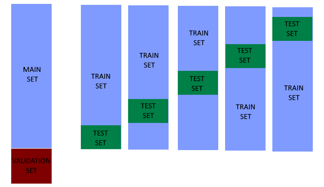
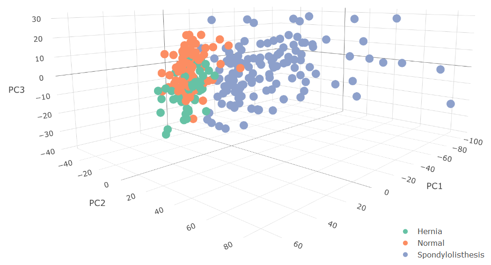

\newpage
\tableofcontents
\newpage

```{r LoadLibraries, message=FALSE, warning=FALSE, include=FALSE}
if(!require(tidyverse)) install.packages("tidyverse", repos = "http://cran.us.r-project.org")
if(!require(caret)) install.packages("caret", repos = "http://cran.us.r-project.org")
if(!require(pamr)) install.packages("pamr", repos = "http://cran.us.r-project.org")
if(!require(Rborist)) install.packages("Rborist", repos = "http://cran.us.r-project.org")
if(!require(neuralnet)) install.packages("neuralnet", repos = "http://cran.us.r-project.org")
#README BEFORE GOING FURTHER
# Some different packages were used, be aware while downloading them.
```

#Introduction

<div style="text-align: justify;">
This project is the last part of the `HardvardX Data Science Capstone` and it's a your own choice type project. Here we will have to face a real Machine Learning problem of our own choice without any type of help but ourselves. With the data selection, we are provided two different interesting web pages where we can find data to test our knowledge, in this case the one from the [University of California Irvine](https://archive.ics.uci.edu/ml/index.php) was the chosen one.

The first main choice was related to which type of outputs we want to work with. In Machine Learning there's two main types, Continuous or Regression and Categorical or Classification. Since the previous project was a Recommendation System and the outputs were continuous this project has been developed based on classification systems.
</div>

##About me

<div style="text-align: justify;">
Just to introduce a bit of myself, my name is Joan Jaume Oliver and I'm a last year engineering student at the [Universitat Politècnica de Catalunya](https://www.upc.edu/en) (Spain). I'm passionate about anything related to Machine Learning and Artificial Intelligence, main reason I have been doing this course on my free time for the last three months.

I would like to mention that English is my third language, so you would have to apologize me if something written down doesn't feel right. Sorry in advance!

Do not hesitate to contact me if you have any questions.

You can contact me at: <joanjaumeoliver@gmail.com>
</div>

##About the data set

<div style="text-align: justify;">
About all the possible data sets to choose from, i just don't know why, but this one took my attention. I don't know if it was because it's based on a field so different from what I currently work with or just because of the scope. Creating a model that could help doctors with their decisions would be fantastic.

This data set it's based on the vertebral column and each patient is represented in the data set by six biomechanical attributes derived from the shape and orientation of the pelvis and lumbar spine. In total, `310` patients were tested. (The data set can be found [here](http://archive.ics.uci.edu/ml/datasets/vertebral+column).)
</div>

```{r DownloadingData, echo=TRUE, message=FALSE, warning=FALSE}
#(Downloading data set from my Github project repository).
dl <- tempfile()
download.file(paste("https://raw.githubusercontent.com/joanjaumeoliver/",
                "Vertebral-Column/master/Vertebral-Column%20Data.csv",sep=""), dl)
data <- read_csv(dl)
rm(dl)

#(Renaming the data set columns just to fit the A4 pdf file).
names(data) <- c("var1","var2","var3","var4",
                 "var5","var6","Y")
head(data) %>% knitr::kable()
```

\newpage

#Analysis

<div style="text-align: justify;">
Before start trying different algorithms, we have to check out the data set and see if there's anything that needs to be done.
</div>

##Modifying the data

<div style="text-align: justify;">
Let's start by looking through our data.
</div>

```{r Preprocessing Data, message=FALSE, warning=FALSE}
#(Check for NA values).
if(any(is.na(data))){print("There's NA values")}

#(Let's see the summary of our data)
#(Divide the data just to fit the A4 .pdf)
summary(data)[,1:3] %>% knitr::kable()
summary(data)[,4:7] %>% knitr::kable()
```

<div style="text-align: justify;">
As seen in the data summary, there seems to be an outlier in the `var6` since the difference between the median and the mean is not small. Although it might be correct that the median and mean has such a deviation because of an uncommon data distribution, seems more that there's a register that contains a typo error.
</div>
```{r Preprocessing Data 2,message=FALSE, warning=FALSE}
data %>% arrange(var6) %>% select(var6) %>% tail() %>% knitr::kable()

#(Which register is the outlier?)
tibble(Row=which.max(data$var6),Value=max(data$var6)) %>% knitr::kable()
```

<div style="text-align: justify;">
As we see there's a `418` value that is following a `148`, this seems, at least to me, that the user that introduced all these values swapped the position of the first two characters. This is what we can call as an outlier and in this situation an action is required, this value could affect our Machine Learning models.

This is a data set that's related to medicine, so if this were another situation as, for example, when a hospital has asked you help to see if there's a possibility to try applying machine learning techniques here, I would stop the project and ask if this is a typo or not.

If this was a typo, the best solution would be to update the data set and continue with our modeling, but if not, this would be that the data set we are given isn't well-done and is inconsistent. The existence of an outlier would mean that we have not taken into account all `abnormal` conditions and possibilities.

But, as this is a capstone project this register could be easily ignored or modified since both of these solutions wouldn't affect our results too much.

In this exact case, the register will be removed.
</div>

```{r Preprocessing Data 3,message=FALSE, warning=FALSE}
#(Let's remove this register from our data)
data <- data[-which.max(data$var6),]
#(As we see, the outlier has been correctly removed)
summary(data)[,4:7] %>% knitr::kable()
```

<div style="text-align: justify;">
This data set output has been renamed with `Y`, let's see how it's distributed.
</div>
```{r Preprocessing Data 4, message= FALSE, warning= FALSE}
#(How many different classes are we working with?)
tibble(Y=data$Y %>% unique()) %>% knitr::kable()
```

<div style="text-align: justify;">
As we see, we have two classes that correspond to an `abnormal` column spine, so as with some classification training two and just two classes are needed, let's create another data set with just two classes instead of three.
</div>

```{r Preprocessing Data 5, message= FALSE, warning= FALSE}
#(Named data2 because of the two classes).
data2 <- data %>% mutate(Y=ifelse(Y!="Normal","Abnormal","Normal"))

#(Renaming data to data3).
data3 <- data

tibble(Y=data2$Y %>% unique()) %>% knitr::kable()
```

<div style="text-align: justify;">
Now, all our data has been prepared for machine learning, let see if it works!
</div>

##Tools for analysing the data

<div style="text-align: justify;">
With this type of Machine Learning algorithms, is quite interesting plotting its confusion matrix in order to see how well they did it.

Let's create a function to do so:
</div>

```{r Tools Data, message=FALSE, warning=FALSE, fig.align='center',fig.width=4, fig.height=3}
ConfMatrixPlot <- function(Matrix){
  confusion<-as.data.frame(as.table(scale(as.matrix(Matrix),center=FALSE)))
  colnames(confusion)<-c("Reference","Prediction","Freq")
  ggplot(confusion) + geom_tile(aes(x=Reference, y=Prediction, fill=Freq)) +
    scale_x_discrete(name="Actual Class") + 
    scale_y_discrete(name="Predicted Class") +
    scale_fill_gradient(breaks=seq(from=-.5, to=4, by=.2),low="darkorchid4",
                        high="yellow") + 
    labs(fill="Normalized\nFrequency")
}

#(Confusion Matrix of diagonal matrix)
ConfMatrixPlot(diag(3))
```

<div style="text-align: justify;">
As we have seen above, a 3x3 diagonal matrix has been plotted. This would be equivalent to an accuracy of 100%.
</div>

##Train and Validation data sets

<div style="text-align: justify;">
Since now, the sets had only been modified and prepared, but if we want to apply machine learning to them, it's quite essential have a train and validation set.

In this case, since we don't have an excessive amount of data, a 10% will be randomly selected as the validation set.
</div>

```{r CreatingAuxiliarSets, message=FALSE, warning=FALSE}
#(Using seed since probability is going to be used).
set.seed(1)
main_index <- createDataPartition(y = data$Y, times = 1, p = 0.1, list = FALSE)
main_set3 <- data3[-main_index,]
validation_set3 <- data3[main_index,]

main_set2 <- data2[-main_index,]
validation_set2 <- data2[main_index,]

rm(main_index)
```

<div style="text-align: justify;">
Now that we already have the validation set, we have to create other train and test sets from the main ones in order to train the algorithm and optimize model parameters.
</div>

```{r CrossValPlot, echo=FALSE, fig.cap="Cross Validation", out.width = '80%',fig.align='center'}

```

<div style="text-align: justify;">
In this case, five sets from the main one are going to be created.
</div>

```{r CrossValidation,message=FALSE, warning=FALSE}
#(Just a random seed)
set.seed(1997)

#(New index to be used)
test_index <- createDataPartition(y = main_set3$Y, times = 5, p = 0.1, list = FALSE)

#(Creating a list of train sets)
trains_set3 <- list(main_set3[-test_index[,1],],main_set3[-test_index[,2],],
                    main_set3[-test_index[,3],],main_set3[-test_index[,4],],
                    main_set3[-test_index[,5],])
#(Creating a list of test sets)
tests_set3 <- list(main_set3[test_index[,1],],main_set3[test_index[,2],],
                   main_set3[test_index[,3],],main_set3[test_index[,4],],
                   main_set3[test_index[,5],])
rm(test_index)
```

##Principal Component Analysis (PCA)

<div style="text-align: justify;">
We are currently working with a model for a data set that has six different variables and tree possible outputs. In this case, if we wanted to represent them, we wouldn't have enough dimensions, so if we really want to represent them in a two or three dimensional system, we have to do a process called dimension reduction.

The first principal component (PC) of a matrix X is the linear orthogonal transformation of X that maximizes its variability. The function prcomp provides us with it.

To begin with, let's see how the correlations of the matrix are.
</div>

```{r PCA1,message=FALSE, warning=FALSE}
x<-main_set2 %>% select(-Y) %>% as.matrix()
cor(x) %>% knitr::kable()
```

<div style="text-align: justify;">
We see that the logic behind it's quite difficult to understand since some variables are highly related while others are just totally different.
</div>

```{r PCA2,eval=FALSE, include=TRUE, message=FALSE, warning=FALSE}
pca<-prcomp(x)
summary(pca)
```

\begin{table}[ht]
\centering
\begin{tabular}{rrrrrrr}
  \hline
 & PC1 & PC2 & PC3 & PC4 & PC5 & PC6 \\ 
  \hline
Standard deviation & 37.0910 & 17.1085 & 11.9443 & 9.9579 & 8.7944 & 0.0000 \\ 
  Proportion of Variance & 0.6922 & 0.1473 & 0.0718 & 0.0499 & 0.0389 & 0.0000 \\ 
  Cumulative Proportion & 0.6922 & 0.8394 & 0.9112 & 0.9611 & 1.0000 & 1.0000 \\ 
   \hline
\end{tabular}
\end{table}

<div style="text-align: justify;">
We see that with the just first two PC, we are already taking into account nearly 83% of the important effects of our data set.
</div>

```{r Hide1, echo=FALSE}
pca<-prcomp(x)
```

```{r PCA3,message=FALSE, warning=FALSE,out.width = '60%',fig.align='center',fig.cap="2D Principal Component Analysis"}
data.frame(pca$x[,1:2], Class=main_set3$Y)%>%
  ggplot(aes(PC1,PC2, fill = Class))+
  geom_point(cex=3, pch=21) +
  coord_fixed(ratio = 1)
```

<div style="text-align: justify;">
Looking at the figure above, we see that the blue class, `Spondylolisthesis` would be easier to predict than the others two since they're mixed up.
The third PC was near the 7% could exist a difference of Z axis between `Hernia` and `Normal` classes? Let's check it with a 3D plot.
</div>

```{r 3D Plot, eval=FALSE,include=TRUE,message=FALSE, warning=FALSE}
temp <- data.frame(pca$x[,1:3], Class=main_set3$Y)

plot_ly(temp,x =temp$PC1, y = temp$PC2, z = temp$PC3, color = temp$Class) %>%
  add_markers() %>%
  layout(scene = list(xaxis = list(title = 'PC1'),
                      yaxis = list(title = 'PC2'),
                      zaxis = list(title = 'PC3')))
```

```{r 3DPlot, echo=FALSE, fig.cap="3D Principal Component Analysis",fig.align='center',out.width = '60%'}
#(Because of the expensive Plotly subscription)

```

<div style="text-align: justify;">
If you want to interact with it, you could find it at: [3D PCA Plot (html format)](https://raw.githack.com/joanjaumeoliver/Vertebral-Column/master/3D%20PCA%20Plot.html).
</div>

```{r Hide2, echo=FALSE}
rm(x)
rm(pca)
```

<div style="text-align: justify;">
With the two last plots we see that with the neighbor algorithms we will be able to predict `Spondylolisthesis` but not distinguish easily between `Hernia` and `Normal` spine columns.
</div>

##Algorithms

<div style="text-align: justify;">
The data used in this project is quite unique and specific, reason we couldn't possibly find another similar data set that would have been of any help. The normal column spine of a person isn't easily explained with numerical values.

So, as we really don't know which type of algorithms will better work on this data set, it's quite interesting using some of each type. In this case, the data is going to be tested with:
  - Distance based methods. (kNN and Centroids)
  - Probability based methods. (Naïve Bayes)
  - Rules based methods. (Decision Trees, Forests and AdaBoost)
  - SVM (Lineal, Radial and Polygonal)
</div>

###kNN
<div style="text-align: justify;">
In Machine Learning there's huge amounts of different algorithms that can be used, but commonly in distance based methods, the two more used are `kNN` and `Centroids`. Let's see if it works as we saw with the PCA.
</div>

```{r knn3,message=FALSE, warning=FALSE,fig.cap="Multiple kNN3 for multiple data sets",out.width = '60%',fig.align='center'}
#(Sequence of all sets).
sets<-seq(1:5)

#(Creating a function to aply kNN to each created set)
list<-sapply(sets, function(sets){
  train_temp <- trains_set3[[sets]]
  test_temp <- tests_set3[[sets]]
  #(Number of k that are going to be tested)
  k <- seq(1:50)
  accuracy<-sapply(k, function(k){
    knn_fit <- knn3(as.factor(Y) ~ ., data = train_temp, k = k)
    y_hat_knn <- predict(knn_fit, test_temp, type = "class")
    confusionMatrix(data = y_hat_knn,
                    reference = as.factor(test_temp$Y))$overall["Accuracy"]
  })
  list(tibble(k,accuracy)) 
})
#(Plotting the results)
ggplot()+
  #(Creating a line for each group of sets).
  geom_line(data=list[[1]],aes(list[[1]]$k,
                               list[[1]]$accuracy,colour="Data set 1"),size=0.8)+
  geom_line(data=list[[2]],aes(list[[2]]$k,
                               list[[2]]$accuracy,colour="Data set 2"),size=0.8)+
  geom_line(data=list[[3]],aes(list[[3]]$k,
                               list[[3]]$accuracy,colour="Data set 3"),size=0.8)+
  geom_line(data=list[[4]],aes(list[[4]]$k,
                               list[[4]]$accuracy,colour="Data set 4"),size=0.8)+
  geom_line(data=list[[5]],aes(list[[5]]$k,
                               list[[5]]$accuracy,colour="Data set 5"),size=0.8)+
  #(Adding colours)
  scale_colour_manual("",values=c("#E69F00","#56B4E9","#009E73","#F0E442","#0072B2"))+
  #(Changing theme)
  theme_light()+  labs(x = "K",y="Accuracy",title="kNN3")+
  #(Adding title and subtitle)
  theme(plot.title = element_text(hjust = 0.5),
        plot.subtitle = element_text(hjust = 0.5,face="italic"))
```

<div style="text-align: justify;">
As we see, depending on the data set we got more or less accuracy. See for example the comparison between `Data set 5` and `Data set 1`.
This is caused because of the neighbors influence between the `Hernia` and `Normal` classes.

Let's use Caret with just one of our test and train sets. Remember, as Model `knn3` is not in the caret's built-in library, we can use `kNN` in its place.
</div>

```{r knn,message=FALSE, warning=FALSE}
#(Set to always get the same results).
set.seed(1997)
#(Training).
train_knn <- train(as.factor(Y) ~ ., method = "knn", data = trains_set3[[1]])
#(Aplying the training to our test set).
y_hat_knn <- predict(train_knn, tests_set3[[1]], type = "raw")
#(Extracting the confusion matrix).
confusion_matrix<-confusionMatrix(y_hat_knn, as.factor(tests_set3[[1]]$Y))

#(Printing the results).
tibble(Accuracy=confusion_matrix$overall[["Accuracy"]]) %>% knitr::kable()
```

<div style="text-align: justify;">
Plotting its confusion matrix in order to see how well it did.
</div>

```{r knnplot,message=FALSE, warning=FALSE,fig.align='center',out.width = '60%',fig.cap="kNN Confusion Matrix"}
#(Printing the confusion matrix).
ConfMatrixPlot(confusion_matrix$table)
```

<div style="text-align: justify;">
As we see, we got no problem at all with the `Spondylolisthesis` class. This was easily observed with the PCA plots above where we find that this class was far away from the other two that were mixed among them.

If we have to understand our results, we see that the real problem was that we predicted a few users of a hernia, while they had normal column spines.
</div>

```{r knnplot2,message=FALSE, warning=FALSE,fig.align='center',out.width = '60%',fig.cap="kNN default parameter evolution"}
#(Plotting kNN with default k parameter evolution).
ggplot(train_knn, highlight = TRUE)
```

```{r knnAuxiliar, echo = FALSE}
rm(train_knn,y_hat_knn, confusion_matrix)
```

<div style="text-align: justify;">
Let's now use `Caret Package` automatic cross validation and tunning parameters system.
</div>

```{r knnplot3,message=FALSE, warning=FALSE,fig.align='center',out.width = '60%',fig.cap="kNN parameter evolution"}
set.seed(1997)
train_knn <- train(as.factor(Y)~ ., method = "knn",
                   data = main_set3,
                   #(Just a sequence to test different parameters).
                   tuneGrid = data.frame(k = seq(9, 71, 2)))

#(Plotting it's evolution)
ggplot(train_knn, highlight = TRUE)

#(BestTune results)
tibble(`Best k`=train_knn$bestTune$k) %>% knitr::kable()

#(Accuracy results)
tibble(Accuracy=max(train_knn$results$Accuracy),
       SD=train_knn$results$AccuracySD[which.max
                   (train_knn$results$Accuracy)],
       bestTune=paste("k = ",train_knn$bestTune$k,sep=""))%>% knitr::kable()
```

<div style="text-align: justify;">
If we look closely at the k parameter evolution, we see that as the higher the number of neighbors used is, the more mixed the result gets and worse the accuracy is. If we use a group of neighbors quite big, a lot of data from `Hernia` and `Normal` column spine get mixed.
</div>

```{r ResultsTibbleknn, echo=FALSE}
accuracy_results <- tibble(Method = "knn", 
                           Accuracy = max(train_knn$results$Accuracy),
                           SD=train_knn$results$AccuracySD[which.max(train_knn$results$Accuracy)],
                           bestTune=paste("k = ",train_knn$bestTune$k,sep=""))
```

<div style="text-align: justify;">
We obtained an accuracy of about `0.8`that's not bad at all, but isn't good enough. It could be a good approximation, but it wouldn't be useful with the definitive model.
</div>

###Centroids

<div style="text-align: justify;">
Centroids are the other distance based method typically used in Machine Learning, let's see how it works with our data.
</div>

```{r Centroids,message=FALSE, warning=FALSE,fig.align='center',out.width = '60%',fig.cap="Centroids threshold parameter evolution",results = 'hide'}
set.seed(1997)
#(Training of Nearest Shrunken Centroids)
train_pam <- train(as.factor(Y)~ ., method = "pam",
                   data = main_set3,
                   #(Just a sequence to test different parameters).
                   tuneGrid=data.frame(threshold=seq(1,9)))

#(Plotting it's evolution)
ggplot(train_pam, highlight = TRUE)
```

<div style="text-align: justify;">
As we see and as with neighbors, the biggest is the parameter, the most points are used and the lowest the accuracy is.
</div>

```{r Centroids2,message=FALSE, warning=FALSE}
#(BestTune results)
tibble(`Best Threshold`=train_pam$bestTune$threshold) %>% knitr::kable()

#(Accuracy results)
tibble(Accuracy =
       max(train_pam$results$Accuracy),
       SD=train_pam$results$AccuracySD[which.max(train_pam$results$Accuracy)],
       bestTune=paste("threshold = ",train_pam$bestTune$threshold,sep=""))%>% 
       knitr::kable()
```

```{r ResultsTibblepam, echo=FALSE}
accuracy_results <- rbind(accuracy_results,tibble(Method = "pam", 
                      Accuracy = max(train_pam$results$Accuracy),
                      SD=train_pam$results$AccuracySD[which.max(train_pam$results$Accuracy)],
                      bestTune=paste("threshold = ",train_pam$bestTune$threshold,sep="")))
```

<div style="text-align: justify;">
We got an accuracy about `0.75`, that's a bit worse than `knn`.
</div>

###Logistic Regression

<div style="text-align: justify;">
Aside of distance based methods, there's also methods based on probability. Logistic Regression is an example of it. (It works with two class outputs, so since we got three, we can consider `Hernia` and `Spondylolisthesis` as `Abnormal`).
</div>

```{r LogisticRegression}
#(Two class outcomes)
#(Creating the formula)
fit_glm <- glm(as.factor(Y) ~ var1+var2+var3+var4+var5+var6, 
               data=trains_set3[[1]], family = "binomial")
p_hat_glm <- predict(fit_glm, tests_set3[[1]])

tibble(Class=tests_set3[[1]]$Y,Probability=p_hat_glm)[1:6,] %>% knitr::kable()
tibble(Class=tests_set3[[1]]$Y,Probability=p_hat_glm)[22:29,] %>% knitr::kable()
```

<div style="text-align: justify;">
Know that we got a vector of probabilities we just need to define the range for `Normal` and `Abnormal` outputs, but as we see, it doesn't matter how we define the ranges, we will always get trouble trying to distinguish between `Hernia` and `Normal`.

Let's give Caret and `glm` a try!
</div>

```{r LogisticRegression2,results='hide',warning=FALSE,message=FALSE}

set.seed(1997)
train_glm <- train(as.factor(Y)~ ., method = "glm",
                   data = main_set2)
```

```{r LogisticRegression3}
tibble(Accuracy=train_glm$results$Accuracy,
       AccuracySD=train_glm$results$AccuracySD) %>% knitr::kable()
```

```{r LogisticRegression4,echo=FALSE}
accuracy_results <- rbind(accuracy_results,tibble(Method = "glm", 
                       Accuracy = max(train_glm$results$Accuracy),
                       SD=train_glm$results$AccuracySD
                       [which.max(train_glm$results$Accuracy)],
                                          bestTune=""))
```

<div style="text-align: justify;">
We got an accuracy of about 0.8 as with the Neighbors model. It's not perfect, but it's a beginning.
</div>

###Naïve Bayes

<div style="text-align: justify;">
Naive Bayes is also a probabilistic method based on applying Bayes's theorem with strong independence between assumptions.
</div>

```{r NaiveBayes, warning=FALSE}
set.seed(1997)
train_bayes <- train(as.factor(Y)~ ., method = "naive_bayes",
                   data = main_set3)
tibble(Accuracy=train_bayes$results$Accuracy,
       AccuracySD=train_bayes$results$AccuracySD) %>% knitr::kable()
```

```{r NaiveBayes2, echo=FALSE}
accuracy_results <- rbind(accuracy_results,tibble(Method = "naive_bayes", 
                                                  Accuracy = train_bayes$results$Accuracy,
                                                  SD=train_bayes$results$AccuracySD,
                                                  bestTune=""))
```

<div style="text-align: justify;">
As we see, it works as others probability methods as Logistic Regression.

But, if we use the Bayesian Generalized Linear Model?
</div>

```{r BayesGLM, warning=FALSE}
set.seed(1997)
train_bayesglm <- train(as.factor(Y)~ ., method = "bayesglm",
                     data = main_set3)

tibble(Accuracy=train_bayesglm$results$Accuracy,
       SDAccuracy=train_bayesglm$results$AccuracySD) %>% knitr::kable()
```

```{r BayesGLM2, echo=FALSE}
accuracy_results <- rbind(accuracy_results,tibble(Method = "bayesglm", 
                                                  Accuracy = train_bayesglm$results$Accuracy,
                                                  SD=train_bayesglm$results$AccuracySD,
                                                  bestTune=""))
```

<div style="text-align: justify;">
Getting such a bad accuracy confirms our theory that our data is not linear and neither can be predicted with distance or simple probability methods.
</div>

###QDA and LDA
<div style="text-align: justify;">
QDA and LDA are two classic classifiers, with, as their names suggest, with a linear or a quadratic decision surface, respectively.
</div>

```{r QDA, include=TRUE, eval=FALSE}
set.seed(1997)
#(Train QDA - Caret)
train_qda <- train(as.factor(Y)~ ., method = "qda",
                   data = main_set3)
```

<div style="text-align: justify;">
When `QDA` runs, returns `Model fit failed, rank deficiency in group Hernia` error because of the small number of classes we've got.
</div>

```{r QDA2, echo=FALSE}
accuracy_results <- rbind(accuracy_results,tibble(Method = "qda", 
                                     Accuracy = "Rank deficiency in group Hernia",
                                     SD="",
                                     bestTune=""))
```

```{r LDA, warning=FALSE}
set.seed(1997)
#(Train LDA)
train_lda <- train(as.factor(Y)~ ., method = "lda",
                   data = main_set3)

#(Print results)
tibble(Accuracy= train_lda$results$Accuracy, 
       AccuracySD=train_lda$results$AccuracySD) %>% knitr::kable()
```

<div style="text-align: justify;">
Unlike `QDA`, `LDA` has run successfully reaching an accuracy of about `0.83`.
</div>

```{r LDA2, echo =FALSE}
accuracy_results <- rbind(accuracy_results,tibble(Method = "lda", 
                                                  Accuracy = train_lda$results$Accuracy,
                                                  SD=train_lda$results$AccuracySD,
                                                  bestTune=""))
```

###Recursive Partitioning and Regression Trees
<div style="text-align: justify;">
Let's try a few tree's alternatives.
</div>

```{r Rpart, message=FALSE}
set.seed(1997)
#(Running Recursive Partitioning and Regression Trees)
train_rpart <- train(as.factor(Y) ~ .,
                     method = "rpart",
                     tuneGrid = data.frame(cp = seq(0.0, 0.1, len = 25)),
                     data = main_set3)
```

<div style="text-align: justify;">
As with most of the rules based methods, we got an accuracy of about `0.80`.
</div>

```{r Rpart2, message=FALSE,fig.align='center',out.width = '60%',fig.cap="Rpart complexity parameter evolution"}
#(Plotting Complexity parameter default values evolution)
plot(train_rpart)
#(Printing results)
tibble(Accuracy=max(train_rpart$results$Accuracy),
       AccuracySD=train_rpart$results$AccuracySD
       [which.max(train_rpart$results$Accuracy)],
         BestTune=paste("cp = ",train_rpart$bestTune,sep="")) %>% knitr::kable()
```

```{r Rpart3, message=FALSE, echo=FALSE}
accuracy_results <- rbind(accuracy_results,tibble(Method = "rpart", 
                                                  Accuracy = max(train_rpart$results$Accuracy),
                                                  SD=train_rpart$results$AccuracySD[which.max(train_rpart$results$Accuracy)],
                                                  bestTune=paste("cp = ",train_rpart$bestTune,sep="")))
```

###Rapid Decision Tree Construction and Evaluation

```{r Rborist, message=FALSE}
set.seed(1997)
#(Running Rapid Decision Tree Construction and Evaluation - Rborist)
train_rborist <- train(as.factor(Y) ~ .,
                     method = "Rborist",
                     #(A bit of tunning parameters)
                     tuneGrid = data.frame(predFixed = 2, minNode = c(3, 50)),
                     data = main_set3)
#(Printing results)
tibble(Accuracy=max(train_rborist$results$Accuracy),
       AccuracySD=train_rborist$results$AccuracySD
       [which.max(train_rborist$results$Accuracy)],
         BestTune=paste("predFixed = ",train_rborist$bestTune[1],
                        " minNode = ",train_rborist$bestTune[2])) %>% knitr::kable()
```
```{r Rborist2, echo=FALSE}
accuracy_results <- rbind(accuracy_results,tibble(Method = "Rborist", 
                                                  Accuracy = max(train_rborist$results$Accuracy),
                                                  SD=train_rborist$results$AccuracySD[which.max(train_rborist$results$Accuracy)],
                                                  bestTune=paste("predFixed = ",train_rborist$bestTune[1]," minNode = ",train_rborist$bestTune[2])))
```

###RF
```{r RF, message=FALSE}
#(Applying Random Forests)
set.seed(1997)
train_rf <- train(as.factor(Y) ~ .,
                       method = "rf",
                       data = main_set3)

#(Printing results)
tibble(Accuracy=max(train_rf$results$Accuracy),
       AccuracySD=train_rf$results$AccuracySD
       [which.max(train_rf$results$Accuracy)],
         BestTune=paste("MTYR = ",train_rf$bestTune,sep="")) %>% knitr::kable()
```

###Adaboost

```{r Adaboost, message=FALSE}
set.seed(1997)
#(Running Adaboost)
train_adaboost <- train(as.factor(Y) ~ .,
                       method = "adaboost",
                       data = main_set2)

#(Printing results)
tibble(Accuracy=max(train_adaboost$results$Accuracy),
       AccuracySD=train_adaboost$results$AccuracySD
       [which.max(train_adaboost$results$Accuracy)],
       BestTune=paste("Iterations =",train_adaboost$bestTune$nIter)) %>% knitr::kable()
```

<div style="text-align: justify;">
Even Adaboost is a based rule algorithm and works providing the data different weights to easily classify, we see that in this case isn't working well.
</div>

###Others
<div style="text-align: justify;">
Just to check if the used algorithms were the adequate ones, all of the following were tested out without reaching a solid solution.
</div>

```{r Others algorithms,message=FALSE, warning=FALSE,results = 'hide',eval=FALSE,include=TRUE}
#(List of methods)
method<-c("svmLinear3","svmLinearWeights2","svmRadialSigma","svmRadialCost",
          "svmRadial","gbm","monmlp","mlp","avNNet","wsrf","ranger","loclda",
          "Mlda","pda","pda2","stepQDA","bagFDA","BstLm","LogitBoost","C5.0",
          "C5.0Cost","xgbLinear","lvq","svmLinear","gamboost","sda","sparseLDA",
          "dwdPoly","gamLoess","kknn")

#(Function to apply to all the methods)
Others<-sapply(method,function(x){
  set.seed(1997)
  train <- train(as.factor(Y) ~ .,
                 method=x,
                 data = main_set2)
  return(tibble(Accuracy=max(train$results$Accuracy),SD=max(train$results$AccuracySD)))
})
```

<div style="text-align: justify;">
Although some of them may have achieved an accuracy of about `0.85` it was principally because of the seed and caret cross validation randomness.
</div>

\newpage

#Results

<div style="text-align: justify;">
A lot of different algorithms were tested in order to find which of them was the most accurate with this specific data set, but the best obtained results were always about `0.80`. This is because of the strange data distribution between `Hernia` and `Normal` output classes.

Remember that since now, all the algorithms were tested on the main set, so we are not sure at 100% of how will they act once tested on the validation set.
</div>

```{r ResultsTibble2, include=FALSE}
accuracy_results %>% knitr::kable()
```

<div style="text-align: justify;">
Since the obtained results weren't the ideal ones, just in order to learn a bit more about Machine Learning I decided to test a Neuronal Network, at the most basic level, towards the data set.

To do so, `Neuralnet` library and a few documentations were used.
</div>

##PCA kNN

<div style="text-align: justify;">
Although I decided to test the kNN with the PCA data. As we have previously seen with the first three or four principal components, we can achieve nearly 96% of the data variance. So, will this improve our kNN results?
</div>

```{r PCAkNN,message=FALSE}
#(Seed)
set.seed(1997)

#(PCA all data)
pca_trainset = main_set2 %>% select( -Y )
dat<-as.matrix(validation_set2 %>% select(-Y))

pca = prcomp( pca_trainset)
train = data.frame( Y = main_set2$Y, pca$x[,1:4] )
test = sweep(dat,2,colMeans(dat)) %*% pca$rotation
test <- test[,1:4]

#(Training data)
train_knn <- train(as.factor(Y)~ ., method = "knn",
                   data = train)
#(Results)
tibble("Caret Accuracy"=max(train_knn$results$Accuracy)) %>% knitr::kable()
tibble("Real Accuracy"=confusionMatrix(predict(train_knn,test),factor(validation_set2$Y))$overall["Accuracy"]) %>% knitr::kable()
```

<div style="text-align: justify;">
As we see, the obtained accuracy is similar to all the others, and that's because the data distribution we have in this specific data set.
</div>

##Neuronal Network

<div style="text-align: justify;">
Let's try a totally different alternative.
</div>

```{r NN , message=FALSE}
#(Seed)
set.seed(1997)

#(Binarize data)
main_set2_nn <- main_set2 %>% mutate(Y=ifelse(Y=="Normal",0,1))
validation_set2_nn <- validation_set2 %>% mutate(Y=ifelse(Y=="Normal",0,1))

#(Creating NN Formula)
n = names( main_set2_nn )
f = as.formula( paste( "Y ~", paste( n[!n %in% "Y"], collapse = "+" ) ) )

#(Neuronal Network training)
nn = neuralnet(f,main_set2_nn,hidden = 4, linear.output = FALSE, threshold = 0.1 )

#(Neuronal Network "predict")
nn.results = neuralnet::compute( nn, validation_set2_nn )
results = data.frame( actual = validation_set2_nn$Y, 
                      prediction = round( nn.results$net.result ) )
t = table(results)

#(Print Results)
tibble("Accuracy"=confusionMatrix(t)$overall["Accuracy"]) %>%
        knitr::kable()
```

<div style="text-align: justify;">
As opposed to the previous section, in this one the used model Neuronal Network was used against the `validation set` in order to obtain the real results. But, although the obtained value is quite bigger than normal, we see that there's a huge deviation between the lower and upper accuracy values, this is because of the section of the data that's been taken into account on the Caret cross validation. Since cross-validation is based on data partitions and randomness, we could find that there's better train and test set combinations.

Would this system improve its accuracy if we applied the Neuronal Network to a preprocess data with principal component analysis?
</div>

###PCA Neuronal Network
```{r PCANN, message=FALSE}
#(Seed)
set.seed(1997)

#(Preprocessing data)
#(Getting all the data without the output)
pca_trainset = main_set2_nn %>% select( -Y )
dat<-as.matrix(validation_set2_nn %>% select(-Y))

#(Computing the PCA)
pca = prcomp( pca_trainset)

#(Applying pca to our data)
train = data.frame( Y = main_set2_nn$Y, pca$x[,1:4] )
test = sweep(dat,2,colMeans(dat)) %*% pca$rotation
test <- test[,1:4]

#(Creating NN Formula)
n = names( train )
f = as.formula( paste( "Y ~", paste( n[!n %in% "Y" ], collapse = "+" ) ) )

#(Neuronal Network training)
nn = neuralnet( f, train, hidden =4, linear.output = FALSE, threshold = 0.1)

#(Neuronal Network "predict")
nn.results = neuralnet::compute( nn, test )

#(Results)
results = data.frame( actual = validation_set2_nn$Y, 
                      prediction = round( nn.results$net.result ) )
t = table(results)

#(Print Results)
tibble("Accuracy"=confusionMatrix(t)$overall["Accuracy"]) %>%
        knitr::kable()
```

<div style="text-align: justify;">
As we see, our accuracy has suffered quite an interesting increase in its value with just a simple preprocessing method as PCA. `0.87` is possibly not enough, but at least it's a really good improvement. Our model just failed 4 out of the 31 cases from the validation set.
</div>


#Conclusions

<div style="text-align: justify;">
As we see, the final obtained results are not the desired ones, although with Neuronal Network we improved a bit our accuracy we still got lots of problems. The data from this set isn't possibly the best one, there's some `var` with such a high correlation that basically affect our data and difficult the outputs classification.

In a situation like this one is highly recommend analyzing with more detail all the variables that are being used, and try to redefine the structure of our data deleting columns, adding new ones or modifying others.

We found a critical point where we weren't able to distinguish between two of the three classes. With this in mind and the accuracy being so low, we would not be able to assure with confidence that the created model it's working well.

Even it has been quite a tricky project that hasn't reached positive results, I'm quite satisfied with all done. Has been an interesting way of introducing ourselves on this wide and complex Machine Learning world that's full of possibilities and alternatives and it has forced me into learning more about Machine Learning and revise all what I had previously studied. So, unlikely of the results, I have extended my knowledge and I will possibly continue doing some more Machine Learning algorithms on my free time.
</div>